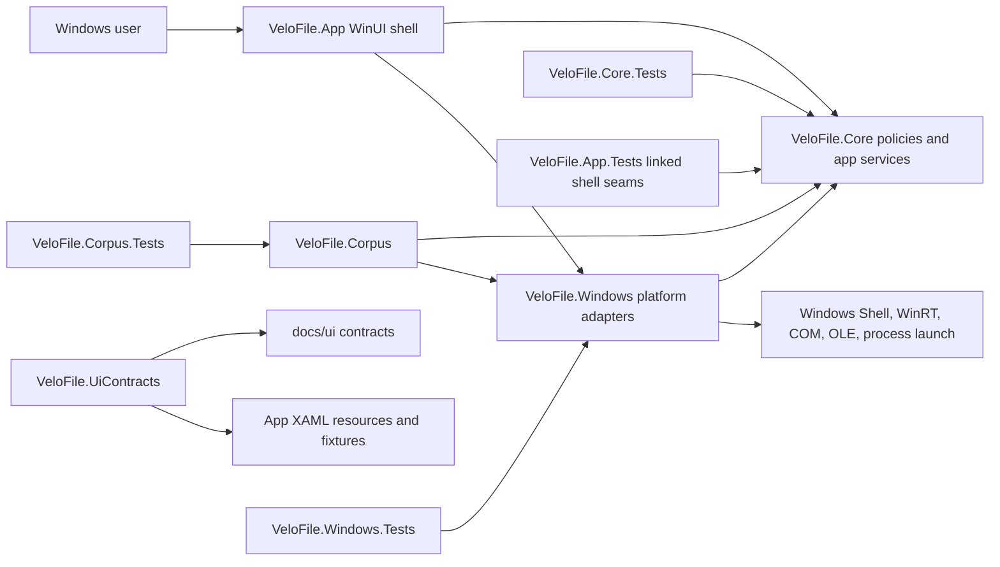

# VeloFile Project Map

Last refreshed: 2026-05-18

This map records observed repository structure, runtime flow, test coverage layout, validation tiers, and release automation boundaries. It is an orientation artifact, not a replacement for the contract in [specs/v1-product-scope.md](../specs/v1-product-scope.md), the test contract in [specs/v1-product-scope.test.md](../specs/v1-product-scope.test.md), the approved PR CI tiering contract in [specs/pr-ci-validation-tiering.md](../specs/pr-ci-validation-tiering.md), or the architecture record in [docs/architecture/system/architecture.md](architecture/system/architecture.md).

## Purpose and Scope

VeloFile is a Windows 10/11 file explorer implemented as a side-by-side MSIX application. The product is not intended to replace Explorer or register broad system integration in V1. The current source tree covers the WinUI shell, product-neutral core services, Windows adapter boundaries, corpus and release tooling, and MSTest suites.

This map covers:

- source projects under [src](../src)
- tests under [tests](../tests)
- release, corpus, benchmark, and packaging scripts under [scripts](../scripts) and [tools](../tools)
- UI contract validation inputs under [docs/ui](ui) and [src/VeloFile.App/Resources](../src/VeloFile.App/Resources)
- durable docs, change records, learning notes, and spec artifacts under [docs](../docs) and [specs](../specs)

This map does not claim external CI status, branch protection state, runtime benchmark measurements, or exhaustive API documentation.

## System Overview

Observed dependency direction:



Projects in [VeloFile.sln](../VeloFile.sln):

- [src/VeloFile.Core](../src/VeloFile.Core): product-neutral models, policies, orchestration, persistence, diagnostics, listing, search, preview, operations, terminal contracts, and shell command state.
- [src/VeloFile.Windows](../src/VeloFile.Windows): Windows-specific adapters for file system listing, Shell operations, drag/drop projection, preview decoding/rendering, terminal discovery, associations, DPI, and MSIX-facing boundaries.
- [src/VeloFile.App](../src/VeloFile.App): WinUI 3 shell, composition root, XAML, view models, shell routes, and user-facing state.
- [tools/VeloFile.Corpus](../tools/VeloFile.Corpus): release-support corpus, compatibility, diagnostics, accessibility, and benchmark report runner.
- [tools/VeloFile.UiContracts](../tools/VeloFile.UiContracts): static token, scope, resource, fixture icon, and optional visual sidecar validator.
- [tests/VeloFile.Core.Tests](../tests/VeloFile.Core.Tests), [tests/VeloFile.Windows.Tests](../tests/VeloFile.Windows.Tests), [tests/VeloFile.App.Tests](../tests/VeloFile.App.Tests), and [tests/VeloFile.Corpus.Tests](../tests/VeloFile.Corpus.Tests): focused contract and adapter tests.

The `.csproj` graph keeps `VeloFile.Core` on `net8.0` without Windows platform references. `VeloFile.Windows` and `VeloFile.App` target `net8.0-windows10.0.19041.0` with minimum platform `10.0.17763.0`. `VeloFile.Windows` references Core. `VeloFile.App` references both Core and Windows and uses Windows App SDK/WinUI package references. `VeloFile.Corpus` references Core and Windows. `VeloFile.UiContracts` is a standalone `net8.0` console tool. App tests link selected App source files while targeting `net8.0`, which creates stable app-shell seams without instantiating the full WinUI app.

## Repository Layout

- [.github/workflows](../.github/workflows): Windows CI and release workflows.
- [docs](../docs): architecture, plans, release evidence, changes, learning notes, proposals, UI contracts, decisions, and this project map.
- [docs/architecture](architecture): system architecture and ADRs.
- [docs/changes](changes): change records and explanations.
- [docs/plans](plans): milestone execution plans.
- [docs/release](release): release verification, benchmark, compatibility, diagnostics, accessibility, packaging, and stable channel artifacts.
- [scripts](../scripts): CI, packaging, release verification, corpus, benchmark, diagnostics, and validation entry points.
- [specs](../specs): V1 product, UI, validation-tier, PR CI tiering, and test contracts.
- [src](../src): app, core, and Windows production projects.
- [tests](../tests): MSTest projects, PowerShell validation tests, UI contract fixtures, and committed visual baselines.
- [tools](../tools): corpus runner and UI contract validator projects.

Observed source file counts at refresh time:

- `src/VeloFile.Core`: 56 C# files
- `src/VeloFile.Windows`: 25 C# files
- `src/VeloFile.App`: 20 C# files
- `tools/VeloFile.Corpus`: 1 C# file
- `tools/VeloFile.UiContracts`: 1 C# file
- `tests/VeloFile.Core.Tests`: 28 C# files
- `tests/VeloFile.Windows.Tests`: 12 C# files
- `tests/VeloFile.App.Tests`: 22 C# files
- `tests/VeloFile.Corpus.Tests`: 32 C# files

## Runtime Flow

Startup:

1. [AppCompositionRoot.cs](../src/VeloFile.App/AppCompositionRoot.cs) creates application state under `%LOCALAPPDATA%\VeloFile`.
2. It composes diagnostics, durable repositories, listing/search/operation/preview/thumbnail/terminal services, Windows adapters, and startup state.
3. [AppShellStartupService.cs](../src/VeloFile.Core/Shell/AppShellStartupService.cs) restores session, settings, favorites, and recent locations into [AppShellCommandSurface.cs](../src/VeloFile.Core/Shell/AppShellCommandSurface.cs).
4. [MainWindow.xaml.cs](../src/VeloFile.App/MainWindow.xaml.cs) wires WinUI events and app-shell routes to [AppShellViewModel.cs](../src/VeloFile.App/ViewModels/AppShellViewModel.cs).

Navigation and listing:

- `AppShellViewModel` delegates tab, path, history, favorites, sidebar, sort, and view-mode behavior through `AppShellCommandSurface`.
- [NavigationWorkspace.cs](../src/VeloFile.Core/Navigation/NavigationWorkspace.cs) owns tabs, history, current path, reopen state, and per-tab view state.
- [FolderListingCoordinator.cs](../src/VeloFile.Core/Listing/FolderListingCoordinator.cs) cancels superseded loads per tab, runs first-viewport listing, and applies only the active generation.
- [WindowsFolderEntrySource.cs](../src/VeloFile.Windows/FileSystem/WindowsFolderEntrySource.cs) enumerates `DirectoryInfo` entries and returns `FileSystemEntrySnapshot` values, treating expected filesystem errors as recoverable skipped entries.

Search and filtering:

- Current-folder filtering is handled in shell/view-model state.
- [RecursiveSearchService.cs](../src/VeloFile.Core/Search/RecursiveSearchService.cs) performs bounded recursive traversal, tracks visited directories, handles cancellation, skips reparse points according to policy, and reports skipped locations and cap state.

Operations:

- [FileOperationService.cs](../src/VeloFile.Core/Operations/FileOperationService.cs) owns operation state, confirmation, conflict handling, cancellation, progress, and completion/failure transitions.
- [WindowsShellFileOperationAdapter.cs](../src/VeloFile.Windows/Shell/WindowsShellFileOperationAdapter.cs) owns Windows copy, move, recycle, permanent delete, rename, and shortcut creation boundaries.
- The App shell refreshes visible listing state after successful mutating operations.

Drag and drop:

- [MainWindow.xaml](../src/VeloFile.App/MainWindow.xaml) configures the visible file list as the primary drop target.
- [MainWindow.xaml.cs](../src/VeloFile.App/MainWindow.xaml.cs) routes drag-over, drag-leave, and drop events to [AppDragDropRoute.cs](../src/VeloFile.App/Input/AppDragDropRoute.cs).
- The route extracts payloads through an app-level extractor, resolves effective drop action through the view model, maps accepted WinUI operations, and commits through `CommitDropAsync`.
- [WinUiStorageItemDropPayloadProjection.cs](../src/VeloFile.App/Input/WinUiStorageItemDropPayloadProjection.cs) and [WindowsOleDragDropDataAdapter.cs](../src/VeloFile.Windows/DragDrop/WindowsOleDragDropDataAdapter.cs) enforce all-or-nothing file-backed projection and non-throwing invalid-path handling.

Preview and thumbnails:

- [PreviewController.cs](../src/VeloFile.Core/Preview/PreviewController.cs) selects a provider, asks [PreviewTimeoutPolicy](../src/VeloFile.Core/Preview/PreviewTimeoutPolicy.cs) for operation-specific budgets, races provider work against timeouts, and exposes preview state.
- [WindowsPreviewProviderFactory.cs](../src/VeloFile.Windows/Preview/WindowsPreviewProviderFactory.cs) orders Windows image, text, PDF, and metadata providers.
- [WindowsImagePreviewDecoder.cs](../src/VeloFile.Windows/Preview/WindowsImagePreviewDecoder.cs) enforces actual input stream length and decodes supported images into render artifacts.
- [WindowsPdfPageRenderer.cs](../src/VeloFile.Windows/Preview/WindowsPdfPageRenderer.cs) enforces actual input stream length and renders requested PDF pages into encoded artifacts.
- [ThumbnailController.cs](../src/VeloFile.Core/Preview/ThumbnailController.cs) owns controller-wide live provider concurrency, visible deadlines, request generations, and terminal thumbnail states.
- `AppShellViewModel` dispatches thumbnail state changes through an `IShellDispatcher` before mutating WinUI-bound row models.

Persistence and diagnostics:

- [DurableDocumentRepository.cs](../src/VeloFile.Core/Persistence/DurableDocumentRepository.cs) reads canonical durable documents, falls back to backups, and emits safe defaults when recovery fails.
- [LocalStatePayloads.cs](../src/VeloFile.Core/Persistence/LocalStatePayloads.cs) and [SessionStatePayload.cs](../src/VeloFile.Core/Persistence/SessionStatePayload.cs) define persisted settings, favorites, recent locations, tabs, window placement, and schema metadata.
- [LocalDiagnosticLogStore.cs](../src/VeloFile.Core/Diagnostics/LocalDiagnosticLogStore.cs) writes local diagnostic JSONL files, crash markers, and last-action markers.
- [DiagnosticStringSanitizer.cs](../src/VeloFile.Core/Diagnostics/DiagnosticStringSanitizer.cs) preserves controlled reason codes while redacting paths, filenames, commands, usernames, and other sensitive strings.

Terminal:

- [TerminalLaunchService.cs](../src/VeloFile.Core/Terminal/TerminalLaunchService.cs) validates the working directory, discovers the terminal, launches through `ITerminalProcessLauncher`, and emits best-effort redacted diagnostics with controlled terminal reason codes.

Validation tooling:

- [tools/VeloFile.UiContracts/Program.cs](../tools/VeloFile.UiContracts/Program.cs) loads `docs/ui/tokens.v1.json`, optional `docs/ui/ui-contract-scopes.v1.json`, XAML resources, fixture icons, and optional visual sidecars, then reports missing keys, type/value mismatches, forbidden literals, invalid fixture icon usage, and unsafe sidecar fields.
- [tools/VeloFile.Corpus/Program.cs](../tools/VeloFile.Corpus/Program.cs) owns corpus report generation for compatibility, preview, benchmark, diagnostics conformance, release classification, and evidence outputs.
- [scripts/Invoke-CorpusTool.ps1](../scripts/Invoke-CorpusTool.ps1) copies corpus, Core, and Windows sources into a scratch-owned workspace, publishes the Corpus tool there, redirects .NET/NuGet/temp state into scratch directories, and runs corpus commands under the resolved scratch root.

## Data Flow

Primary state and payloads observed:

- Navigation state: `NavigationWorkspace`, `NavigationTab`, `NavigationHistoryEntry`, tab snapshots, sort/view/scroll state.
- Listing state: `FolderListingRequest`, `FolderListingState`, `FileSystemEntrySnapshot`, `ListedFileItem`, `VirtualizedListingFeed`.
- Search state: recursive search options, progress batches, skipped locations, cap states, and cancellation.
- Operation state: `FileOperationRequest`, `FileOperationState`, `FileOperationAdapterResult`, conflict records, confirmation records, and progress snapshots.
- Drag/drop state: payload extraction result, file-backed source paths, destination folder, requested action, effective action, and accepted WinUI operation.
- Preview state: `PreviewState`, `PreviewContent`, image/PDF render artifacts, text snippets, metadata fallback, unsupported/failure reasons, and paged preview requests.
- Thumbnail state: request generation, queued/loading/ready/timed-out/failed/unsupported/cancelled states, and thumbnail artifacts.
- Persistence state: durable document envelopes with schema/app version metadata, payloads, backup fallback, unknown-field counts, and safe defaults.
- Diagnostics state: `DiagnosticEvent` instances serialized through the sanitizer into local JSONL reports.
- Release evidence: corpus, compatibility, benchmark, diagnostics, accessibility, and package metadata JSON/Markdown artifacts generated by scripts and `VeloFile.Corpus`.
- UI contract state: JSON token and scope contracts under [docs/ui](ui), governed XAML resources under [src/VeloFile.App/Resources](../src/VeloFile.App/Resources), deterministic fixture resources under [tests/fixtures/ui-contracts](../tests/fixtures/ui-contracts), and optional visual sidecars under [tests/visual/baselines](../tests/visual/baselines).
- Validation-tier state: MSTest categories in `VeloFile.Corpus.Tests` identify `Fast`, `Contract`, `Smoke`, `CorpusScript`, `ReleaseEvidence`, `Benchmark`, `Visual`, and `ManualEvidence` evidence intent.

Important data ownership rule observed: source paths, command lines, raw preview text, and local user details should not cross into serialized diagnostics without redaction or controlled classification.

## External Boundaries

Platform and service boundaries:

- WinUI 3 and Windows App SDK in [VeloFile.App.csproj](../src/VeloFile.App/VeloFile.App.csproj).
- Windows Shell, Win32, COM, OLE, and process launch boundaries in `src/VeloFile.Windows`.
- WinRT imaging and PDF APIs in [WindowsImagePreviewDecoder.cs](../src/VeloFile.Windows/Preview/WindowsImagePreviewDecoder.cs) and [WindowsPdfPageRenderer.cs](../src/VeloFile.Windows/Preview/WindowsPdfPageRenderer.cs).
- Windows drag/drop `DataPackageView` and storage item projection in the App input route.
- Local filesystem under user-controlled paths and `%LOCALAPPDATA%\VeloFile`.
- GitHub Actions hosted Windows runners for current CI and release workflows.
- MSIX packaging tools, MakeAppx, SignTool, package manifest generation, and architecture/RID mapping in [scripts/package-msix.ps1](../scripts/package-msix.ps1).
- Git tag signature verification and GitHub release publishing in [.github/workflows/release.yml](../.github/workflows/release.yml) and [scripts/verify-release-tag.ps1](../scripts/verify-release-tag.ps1).

Tooling boundaries:

- [scripts/ci.ps1](../scripts/ci.ps1) is the main local and CI validation entry point.
- [scripts/release-verify.ps1](../scripts/release-verify.ps1) validates release documentation, manifest policy, change metadata links, packaging contracts, and release evidence shape.
- [scripts/Invoke-CorpusTool.ps1](../scripts/Invoke-CorpusTool.ps1) invokes [tools/VeloFile.Corpus](../tools/VeloFile.Corpus) in isolated scratch/output roots.
- [scripts/run-compat-corpus.ps1](../scripts/run-compat-corpus.ps1), [scripts/run-preview-corpus.ps1](../scripts/run-preview-corpus.ps1), and [scripts/run-benchmarks.ps1](../scripts/run-benchmarks.ps1) are report-generation wrappers.
- [tools/VeloFile.UiContracts](../tools/VeloFile.UiContracts) validates UI contract resources from .NET rather than relying on ad hoc PowerShell parsing.

## Test Map

Observed MSTest coverage at refresh time. Counts below are static `[TestMethod]` or `[DataTestMethod]` declarations, not hosted runtime case counts:

- [tests/VeloFile.Core.Tests](../tests/VeloFile.Core.Tests): 28 C# files and 155 static test declarations. Covers listing, search, filtering, operations, preview controller policy, thumbnails, persistence, diagnostics, terminal, keyboard commands, shell state, sidebar, visibility, selection, and association launch contracts.
- [tests/VeloFile.App.Tests](../tests/VeloFile.App.Tests): 22 C# files and 164 static test declarations. Covers app-shell view-model behavior, command routes, drag/drop route proof, PDF preview navigation shell state, thumbnail dispatcher marshaling, terminal routing, associations, persistence integration seams, release workflow contracts, UI fixture launch, and shell accessibility/static resource contracts through linked source seams.
- [tests/VeloFile.Windows.Tests](../tests/VeloFile.Windows.Tests): 12 C# files and 52 static test declarations. Covers Windows adapter behavior for drag/drop projection, file operations, preview image/PDF/thumbnail boundaries, durable storage, clipboard, terminal discovery/launch, file association launch, and foundation smoke boundaries.
- [tests/VeloFile.Corpus.Tests](../tests/VeloFile.Corpus.Tests): 32 C# files and 109 static test declarations. Covers corpus script isolation, report shape, release evidence classification, validation command documentation, category inventory, PR CI workflow contract tests, rollout evidence, prepared-tool harness behavior, runtime reports, public wrapper smoke, visual baseline inventory, UI contract checks, and tooling drift checks.
- [tests/validation](../tests/validation): PowerShell validation tests for script and corpus isolation behavior.
- [tests/fixtures/ui-contracts](../tests/fixtures/ui-contracts): valid and invalid XAML/JSON fixtures for token, scope, literal, duplicate-key, missing-key, component-resource, and fixture-icon validation.
- [tests/visual/baselines](../tests/visual/baselines): reviewed first-slice visual baseline PNGs and JSON sidecars used as supporting evidence under the UI contracts.

The app test project links selected App source files rather than referencing the WinUI App project. This keeps tests lightweight and deterministic, but it is not the same as a full UI automation pass through rendered XAML.

`VeloFile.Corpus.Tests` currently keeps assembly-wide serialization through [MSTestSettings.cs](../tests/VeloFile.Corpus.Tests/MSTestSettings.cs). The accepted test-runtime contract makes parallelism changes a later reviewed slice.

## CI and Release Map

CI:

- [.github/workflows/ci.yml](../.github/workflows/ci.yml) is the hosted PR/push workflow. It runs `ci-fast-required` and the temporary broad `ci` shadow job on `windows-latest` for `pull_request` and `push` to `main`.
- `ci-fast-required` uses job-level `pwsh`, sets up .NET SDK `10.0.x`, runs `dotnet --info`, restore, Debug build with `--no-restore`, UI contract validation, direct Core/App/Windows test projects, Corpus `Fast|Contract`, and Corpus `CorpusScript&Smoke`. It emits TRX output, uploads test artifacts, and writes a runtime summary reporting `ReleaseEvidence: not run in this lane`, `CorpusScript Smoke: run`, and `Full closeout: not run`.
- The broad `ci` job still invokes [scripts/ci.ps1](../scripts/ci.ps1) during rollout as a shadow/rollback path until maintainers record branch-protection handoff. Current [scripts/ci.ps1](../scripts/ci.ps1) runs `dotnet --info`, solution restore, Debug build with `--no-restore`, UI contract validation against the valid UI fixture tree, and unfiltered solution tests with `--no-build`.
- [.github/workflows/release-evidence.yml](../.github/workflows/release-evidence.yml) defines `ci-release-evidence` for `workflow_dispatch`, nightly schedule, `release/**` branches, `v*` and `v*-rc*` tags, and `merge_group`. It runs explicit Corpus `ReleaseEvidence` validation with release-evidence summary status.
- [.github/workflows/closeout.yml](../.github/workflows/closeout.yml) defines `ci-full-closeout` for manual broad closeout through [scripts/ci.ps1](../scripts/ci.ps1).
- PR #4 run `26062568345` recorded the accepted hosted shadow cycle: `ci-fast-required` passed in 7m20s, broad `ci` passed in 16m01s, and GitHub branch protection for `main` was not configured (HTTP 404), so no external required-check handoff is claimed.

Release:

- [.github/workflows/release.yml](../.github/workflows/release.yml) checks out full tag history, verifies the release tag before packaging, runs release verification, builds MSIX packages, and creates the GitHub release.
- [scripts/verify-release-tag.ps1](../scripts/verify-release-tag.ps1) verifies signed tags through an isolated GPG home and explicit release-key fingerprint allowlist.
- [scripts/package-msix.ps1](../scripts/package-msix.ps1) supports `x86`, `x64`, and `ARM64`, maps them to `win-x86`, `win-x64`, and `win-arm64`, and writes package metadata.
- [docs/release/benchmark-baseline.md](release/benchmark-baseline.md) currently classifies existing benchmark measurements as infrastructure-only unless an app-level driver is present.

Useful local verification commands from [AGENTS.md](../AGENTS.md):

```powershell
dotnet --info
dotnet restore VeloFile.sln
dotnet build VeloFile.sln -c Debug
dotnet test VeloFile.sln -c Debug
pwsh -NoProfile -ExecutionPolicy Bypass -File scripts/ci.ps1
```

## Architecture Rules Observed

- Core stays platform-neutral by project reference and target framework.
- Windows-only APIs are isolated in `src/VeloFile.Windows` or WinUI shell code.
- The App composition root wires concrete adapters while Core services depend on interfaces and policies.
- Production user routes are increasingly represented as app/windowing boundaries rather than direct view-model-only calls.
- Preview, drag/drop, terminal, diagnostics, and file operations use explicit boundary services for external input and platform behavior.
- Diagnostics serialize only controlled values and sanitize untrusted strings before writing local artifacts.
- Release-support tools are expected to classify evidence honestly, separating app-level release evidence from infrastructure-only or manual evidence.
- Scratch/output paths for corpus tooling are explicit and isolated by script.
- UI contract validation is owned by a .NET tool in `tools/` with PowerShell and CI acting as orchestration surfaces.
- Hosted validation is Windows-native; the approved PR CI tiering spec keeps Linux/macOS hosted validation out of scope until a later accepted cross-platform design exists.
- Fast validation tiers are contributor feedback tools. Release readiness still depends on explicit release-evidence, closeout, or accepted release-gate evidence.

## Risk Areas

Observed risks and maintenance pressure points:

- [AppShellViewModel.cs](../src/VeloFile.App/ViewModels/AppShellViewModel.cs) and [MainWindow.xaml.cs](../src/VeloFile.App/MainWindow.xaml.cs) are broad coordination points with many manual event handlers and binding refreshes.
- [tools/VeloFile.Corpus/Program.cs](../tools/VeloFile.Corpus/Program.cs) is a single large tool file that owns multiple evidence domains, which raises coupling and review-cost risk.
- App tests cover shell routes through linked source seams, but not a full WinUI UI automation surface.
- Current benchmark evidence is documented as infrastructure-only when it does not drive the app boundary.
- Association and DPI release evidence are still tracked as not-implemented/manual where automated verifier inputs are absent.
- Hosted PR CI still keeps the broad `ci` shadow job during rollout until maintainer branch-protection handoff is recorded; this preserves rollback but temporarily spends extra hosted minutes.
- Workflow contract tests now guard the PR CI tiering policy, so changes to workflow command selection, runner/shell setup, release-evidence triggers, closeout wiring, or summary behavior should update those tests in the same change.
- The early repository status line in [specs/v1-product-scope.test.md](../specs/v1-product-scope.test.md) appears historically stale because the source tree and test projects now exist.

## Open Questions

- Which future milestone will add an app-level benchmark driver for launch, folder switch, filtering, search, tab switch, context menu, session restore, scroll, slow-tab isolation, and terminal discovery impact?
- When should association and DPI release evidence move from manual or not-implemented classification to automated verifier input?
- Should the app shell continue with manual refresh/event handling, or should a later architecture slice introduce narrower bindable command/view services?
- Should `VeloFile.Corpus` split into smaller command modules after V1 closeout to reduce release-evidence drift risk?
- When should maintainers complete branch-protection handoff so `ci-fast-required` becomes the external required ordinary PR check?
- Should the stale status wording in `specs/v1-product-scope.test.md` be corrected as documentation hygiene in a separate change?

Recommended next skill for the active PR CI validation tiering change: use `code-review` after M5 implementation evidence is committed.
